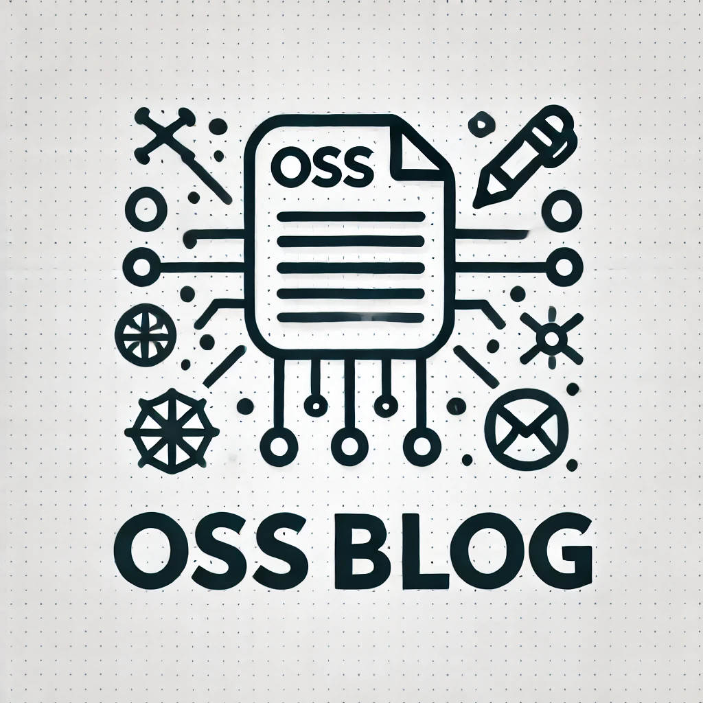

    
    <h1>OSS Blog</h1>

`OSS Blog`は**みんなで記事を作る**ことに焦点を当てた全く新しい技術記事サイトです。
<a href="#english-version">English version is available!!</a>
## 概要
従来の技術記事サイトは、基本的に1人の著者が記事を書いて他の人がそれを読むという形式でした。しかし、その形式だと記事の内容が間違っていたり、古くなっていた場合に著者しか編集はできないので更新されないまま残ってしまうなどこれ以外にもさまざまな問題があると感じていました。そこでこの問題を解決するために、OSS(Open Source Software)の仕組みを活用してみんなが著者であり、読者である技術記事サイト`OSS Blog`を開発することを決めました。

## このサイトが解決できる問題
- 記事の内容が古いままである
- 記事の内容が間違っている
- 勝手に記事が削除される
etc...

## 従来の技術記事サイトとの比較
| 比較点 | OSS Blog | Q | Z |
| --- | --- | --- | --- |
| 記事の作成 | みんなで作成 | 1人で作成 | 1人で作成 | 
| 記事の編集 | みんなで編集 | 著者のみ | 著者のみ |
| 記事の閲覧 | 誰でも閲覧可能 | 誰でも閲覧可能 | 誰でも閲覧可能 |
| 管理体制 | 分散型 | 中央集権 | 中央集権 |

また、これらの点以外にもOSSで誰でも記事を作成、編集ができるので、記事の品質や新しさが保たれるという優れた特徴があります。

## 使用技術
- Next.js
- YamadaUI
- Docker

## コントリビュートの仕方 & 記事の投稿のしかた
バグ修正や機能追加の際にプルリクエストを送るのと同様に記事の投稿をする際にもプルリクエストを送ります。詳細は<a href='./CONTRIBUTING.ja.md'>CONTRIBUTING.md</a>を参照してください。

なぜ記事投稿の際にプルリクエストを送るのですか？

記事投稿の際にプルリクエストを送ることによって、記事の内容が間違っていたり、古い情報のままになることを抑えることができます。自分以外の人に見てもらうことで記事の品質が向上し、より多くの人に有益な情報を提供することができます。

   

    
    <h1>OSS Blog</h1>

`OSS Blog` is a completely new technology article site that focuses on **creating articles together**.

## Overview
Traditional technical article sites typically involve a single author writing an article for others to read. However, if the article contains inaccuracies or becomes outdated, only the author can edit it, which means the incorrect or old information may remain unchanged. To solve this issue, we decided to develop `OSS Blog`, a technical article site where everyone is both an author and a reader, utilizing the concept of OSS (Open Source Software).

## Problems this site can solve
- Articles becoming outdated
- Articles containing inaccuracies
- Articles being deleted without notice
etc...

## Comparison with traditional technical article sites
| Comparison Point | OSS Blog | Q | Z |
| --- | --- | --- | --- |
| Article Creation | Created by everyone | Created by one person | Created by one person |
| Article Editing | Edited by everyone | Only the author | Only the author |
| Article Viewing | Accessible to everyone | Accessible to everyone | Accessible to everyone |
| Management System | Decentralized | Centralized | Centralized |

Additionally, because anyone can create and edit articles through OSS, it ensures that the articles remain high-quality and up-to-date.

## Technologies Used
- Next.js
- YamadaUI
- Docker

## How to Contribute & Submit Articles
Similar to submitting a pull request for bug fixes or feature additions, you also submit a pull request when posting articles. For more details, refer to <a href='./CONTRIBUTING.ja.md'>CONTRIBUTING.md</a>.

Why do you need to submit a pull request when posting an article?

By submitting a pull request when posting an article, it helps prevent inaccuracies or outdated information from remaining. Having others review your article improves its quality and provides more useful information to a wider audience.

