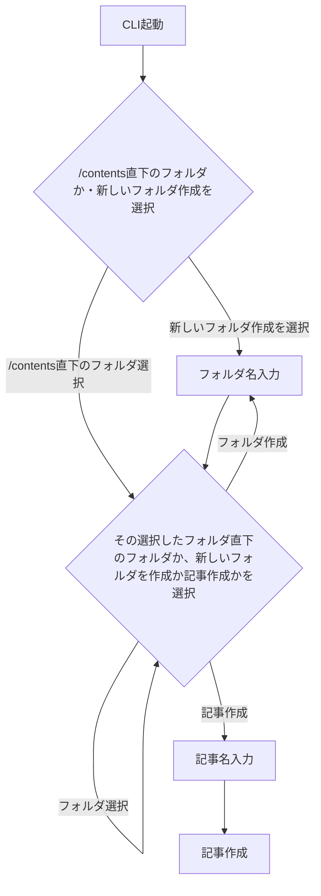

```mermaid
flowchart TD
    A[CLI起動] --> B{/contents直下のフォルダか・新しいフォルダ作成を選択}
    B -->|新しいフォルダ作成を選択| C[フォルダ名入力]
    B -->|/contents直下のフォルダ選択| D{その選択したフォルダ直下のフォルダか、新しいフォルダを作成か記事作成かを選択}
    C --> D
    D -->|フォルダ選択| D
    D -->|フォルダ作成| C
    D -->|記事作成| E[記事名入力]
    E --> F[記事作成]
```
